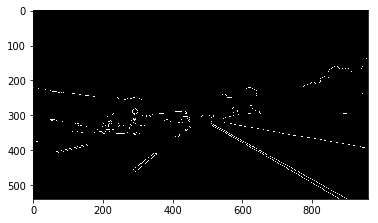
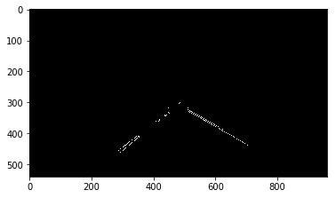
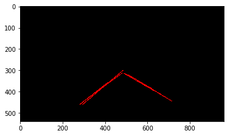

#**Finding Lane Lines on the Road**

### Jupyter notebook

[Link](P1.ipynb)

### Pipeline

My pipeline consists of 5 steps:

Original image:

1. Grayscale

2. Gaussian blur

3. Canny

4. Region of interest

5. Hough transform

In order to draw a single line on the left and right lanes, I modified the draw_lines() function:

1. Separate left and right lines by separating out lines with negative and positive slopes.
2. Run least squares polynomial fit with degree 1 (linear) separately for lines with positive slopes and negative slopes. This gives me two `y = bx + m` lines.
3. To draw the lines, I calculate intersections with region of interest's top (~ middle of the picture) and use these points to draw two lines (one for the left, one for the right).

[Video](test_videos_output/solidYellowLeft.mp4)

### Shortcomings

1. Poor performance on low contrast pictures ([video](test_videos_output/challenge.mp4)).
2. The region of interest is not adjustable. Unwanted elements can get inside the region during steep turns, when the car goes uphill/downhill, or simply on a road bump.
3. Flickering - line detection isn't continuous, some frames show one or two detected lines missing, although the vast majority of frames show good results.

### Possible improvements

1. An adjustable region of interest: the triangle apex should move left/right on turns, and up/down on hills.
2. Probably dynamic contrast/brightness adjustments would help to deal with low contrast conditions.
3. Next frame extrapolation: algorithm could possibly use data from previous frames to calculate most likely lane position on next frames.
